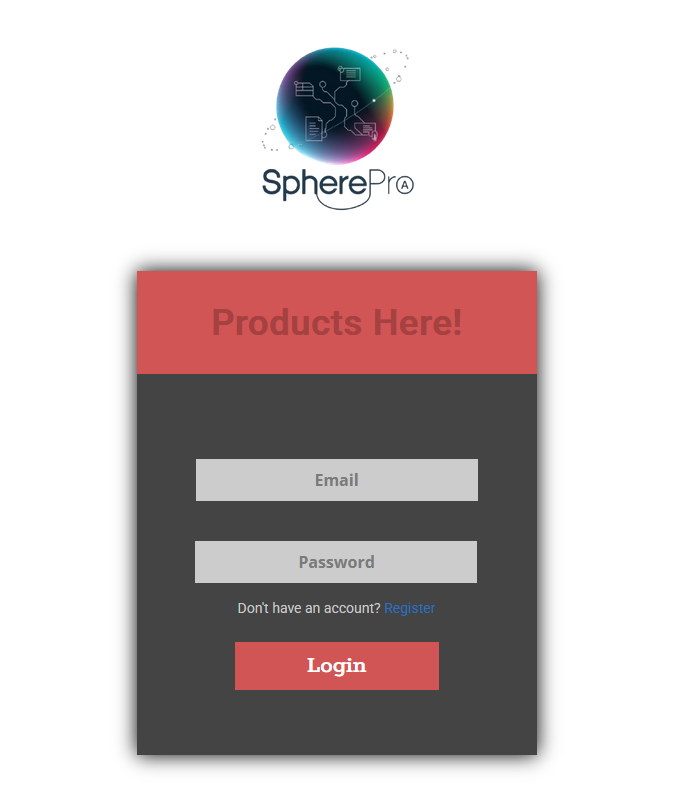
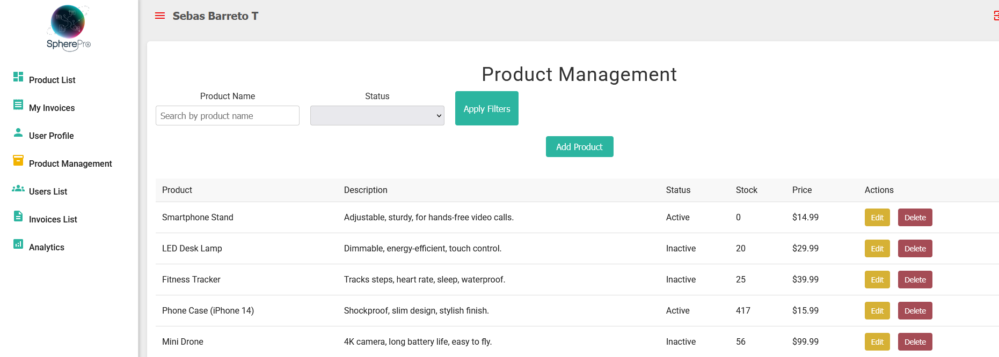
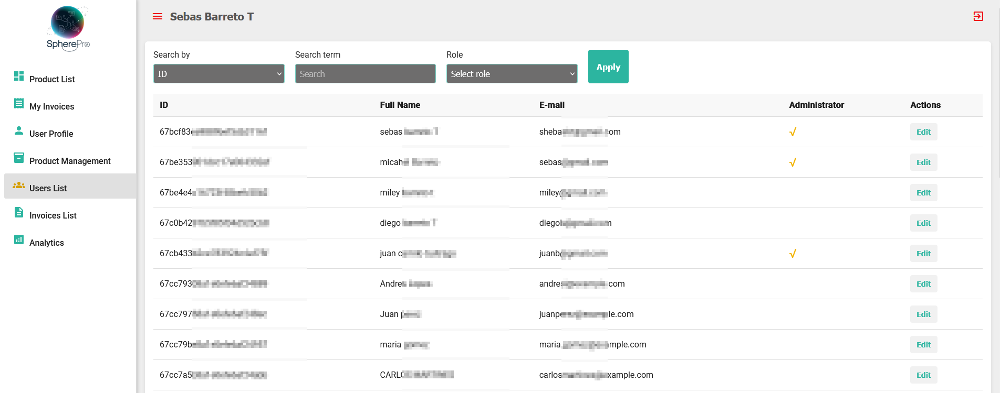
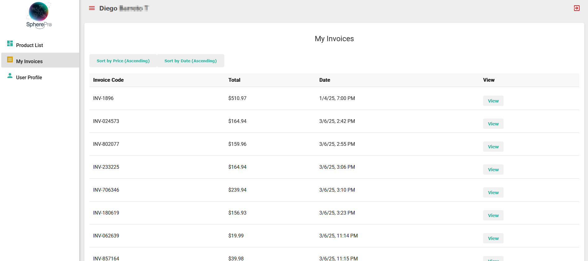
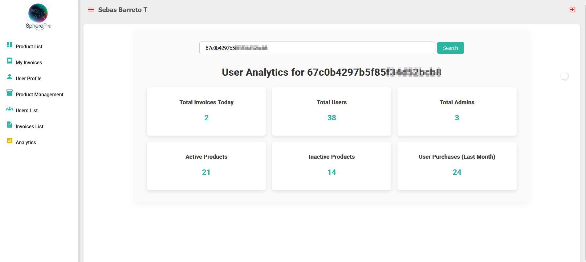

# Sphere Pro: Aplicación de Gestión de Usuarios, Productos y Facturas

## Descripción

Sphere Pro es una aplicación web diseñada para gestionar usuarios, productos y facturas. Utiliza tecnologías modernas para garantizar una experiencia fluida y segura, con autenticación mediante JWT y control de permisos por roles (User, Admin). Esta aplicación es ideal para pequeñas empresas que buscan simplificar sus procesos de ventas y gestión de usuarios.

[Enlace al repositorio en GitHub](https://github.com/SebasBarreto/InvoiceSphere_Pro)

## Tecnologías utilizadas

- **Backend:** NestJS (API REST)
- **Frontend:** Angular (Interfaz fluida y reactiva)
- **Base de datos:** MongoDB Atlas (Almacenamiento flexible en la nube)
- **Despliegue:** AWS EC2
- **Autenticación:** JWT (JSON Web Tokens)

## Instalación y configuración

1. Clona el repositorio:
   [Enlace al repositorio en GitHub](https://github.com/SebasBarreto/InvoiceSphere_Pro)
2. Navega a la carpeta del proyecto:
   cd InvoiceSphere_Pro
3. Instala las dependencias para el Backend (NEstJs):
   cd backend
   npm install
4. Instala las dependencias para el frontend (Angular):
   cd frontend
   npm install
5. Asegúrate de configurar el archivo de entorno para el frontend:
   Abre el archivo frontend/src/environments/environment.ts y pega la IP pública de tu servidor backend en la variable correspondiente.
6. Ejecuta el backend:
   npm run start
7. Ejecuta el frontend:
   ng serve --host 0.0.0.0

Ahora, tu aplicación debería estar funcionando en el navegador. Puedes acceder a ella utilizando la IP pública de la instancia de EC2 en AWS.

utilizando la IP pública de la instancia de EC2 en AWS. [http://3.141.202.8:4200].

## Capturas de Pantalla

### 1. Pantalla de inicio de sesión

Esta imagen muestra la pantalla de inicio de sesión, donde los usuarios pueden ingresar sus credenciales para acceder a la aplicación.

### 2. Gestión de productos

Aquí vemos la interfaz para la gestión de productos, donde los administradores pueden agregar, editar o eliminar productos del inventario.

### 3. Lista de usuarios

Esta imagen ilustra la pantalla que muestra la lista de usuarios registrados en la aplicación, accesible para los administradores.

### 4. Facturas generadas

En esta pantalla, el usuario puede ver todas las facturas que ha generado, con detalles como productos y cantidades.

### 5. Análisis de ventas

Esta captura muestra la sección de análisis, donde se pueden consultar estadísticas sobre las ventas realizadas y el comportamiento de los usuarios.

### 6. Gestión de facturas

Aquí se muestra el panel de administración de facturas, donde los administradores pueden ver todas las facturas generadas y realizar ajustes si es necesario.
